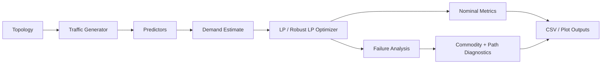

# Learning-Augmented Robust Traffic Engineering

This project implements an end-to-end research prototype for traffic
engineering under dynamic demand and link failures.

## Architecture Overview



## Project Structure

- `src/teproject/`: core source code
- `run_experiment.py`: end-to-end experiment entry point
- `configs/`: JSON experiment configurations
- `outputs/`: generated CSV summaries and plots
- `docs/`: implementation documentation
- `.venv/`: dedicated virtual environment for this project

## Dedicated Environment

This project now uses its own local virtual environment:

```powershell
.\.venv\Scripts\Activate.ps1
```

If you ever need to recreate it:

```powershell
& "C:\Users\sudha\.cache\codex-runtimes\codex-primary-runtime\dependencies\python\python.exe" -m venv .venv
.\.venv\Scripts\python.exe -m pip install -r requirements.txt
```

## Run the Experiment

```powershell
.\.venv\Scripts\python.exe .\run_experiment.py
```

Run a benchmark topology:

```powershell
.\.venv\Scripts\python.exe .\run_experiment.py --config .\configs\abilene.json
.\.venv\Scripts\python.exe .\run_experiment.py --config .\configs\nsfnet.json
```

Run a sweep:

```powershell
.\.venv\Scripts\python.exe .\run_sweep.py --topologies abilene nsfnet --load-scales 0.8 1.0 1.2 --seeds 7 11
```

Generate clean summary plots from an aggregated sweep:

```powershell
.\.venv\Scripts\python.exe .\run_plot_summary.py --input .\outputs\sweeps_full\aggregated_summary.csv --output-dir .\outputs\sweeps_full\plots
```

Prepare report-ready tables and presentation figures from the final sweep:

```powershell
.\.venv\Scripts\python.exe .\run_prepare_report_assets.py --sweep-dir .\outputs\sweeps_ml_compare
```

## Current Advanced Prototype

The current implementation includes:

- synthetic backbone topology generation
- dynamic traffic matrix generation
- baseline predictors
- LSTM traffic prediction
- Transformer traffic prediction
- LP-based multi-commodity flow routing
- scenario-based robust LP routing over nominal and selected failure cases
- uncertainty-aware robust LP routing using LSTM residual uncertainty
- random and critical link-failure evaluation
- fixed-routing failure stress evaluation without immediate rerouting
- CSV and plot output for comparisons
- config-driven topology selection across synthetic and benchmark networks
- benchmark topology loading via TopoHub / Internet Topology Zoo
- multi-run experiment sweeps across topologies, seeds, and load scales
- fairness metrics for failure-side service distribution

## Current Outputs

The experiment writes per-config outputs such as:

- `outputs/sample/summary_results.csv`
- `outputs/abilene/summary_results.csv`
- `outputs/nsfnet/summary_results.csv`
- `failure_disruptions.csv` in each output folder for top disrupted commodities
- `failure_paths.csv` in each output folder for path decomposition of disrupted commodities
- `worst_failure_case.png` for a topology-level visualization of the most severe fixed-failure case
- matching `experiment_results.csv` and plot files in each folder

Sweep runs write aggregate outputs such as:

- `outputs/sweeps/all_run_summaries.csv`
- `outputs/sweeps/aggregated_summary.csv`
- `outputs/sweeps/run_index.csv`
- `outputs/sweeps/plots/summary_nominal_utilization.png`
- `outputs/sweeps/plots/summary_critical_fixed_disruption.png`
- `outputs/sweeps/plots/summary_critical_fixed_fairness.png`
- `outputs/sweeps/plots/abilene_lp_family_comparison.png`
- `outputs/sweeps/plots/nsfnet_lp_family_comparison.png`
- `outputs/sweeps/plots/robust_lp_comparison.csv`
- `outputs/sweeps_ml_compare/report_assets/`

The result tables now include both:

- `*_reopt_*` metrics for failure scenarios where the controller re-optimizes after a failed link
- `*_fixed_*` metrics for stress tests where the original routing plan is held fixed after failure
- per-commodity disruption details for the top disrupted source-destination flows under each fixed-failure scenario
- path-level decomposition for the disrupted commodities so vulnerable routes can be inspected directly
- fairness metrics for served-ratio distribution under fixed-failure scenarios

The experiment also includes:

- `robust_current_demand_lp`
  a scenario-based robust routing baseline that optimizes over the nominal case plus selected failure scenarios
- `uncertainty_aware_lstm_robust_lp`
  an advanced method that inflates the LSTM-predicted demand with residual-based uncertainty before robust routing

## Latest Final Results

The latest official evaluation lives under:

- `outputs/sweeps_ml_compare/`

The focused technical-strengthening ablation study lives under:

- `outputs/ablations_final/`

The strongest current story is:

- `transformer` is now the strongest pure nominal-routing ML method in the latest tuned comparison
- `lstm` remains a strong baseline and still pairs well with the uncertainty-aware robust extension
- `robust_current_demand_lp` is a meaningful resilience baseline
- `uncertainty_aware_lstm_robust_lp` is the strongest advanced LP-family extension, especially on NSFNET

For the focused ablation outputs and takeaways, see:

- [docs/ABLATION_STUDY.md](C:/Users/sudha/OneDrive/Desktop/networks/docs/ABLATION_STUDY.md)
