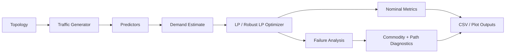

# Learning-Augmented Robust Traffic Engineering

This project implements an end-to-end research prototype for traffic
engineering under dynamic demand and link failures.

## Architecture Overview



## Project Structure

- `src/teproject/`: core source code
- `run_experiment.py`: end-to-end experiment entry point
- `configs/`: JSON experiment configurations
- `outputs/`: generated CSV summaries and plots
- `docs/`: implementation documentation
- `.venv/`: dedicated virtual environment for this project

## Dedicated Environment

This project now uses its own local virtual environment:

```powershell
.\.venv\Scripts\Activate.ps1
```

If you ever need to recreate it:

```powershell
& "C:\Users\sudha\.cache\codex-runtimes\codex-primary-runtime\dependencies\python\python.exe" -m venv .venv
.\.venv\Scripts\python.exe -m pip install -r requirements.txt
```

## Run the Experiment

```powershell
.\.venv\Scripts\python.exe .\run_experiment.py
```

Run a benchmark topology:

```powershell
.\.venv\Scripts\python.exe .\run_experiment.py --config .\configs\abilene.json
.\.venv\Scripts\python.exe .\run_experiment.py --config .\configs\nsfnet.json
```

## Current MVP

The current implementation includes:

- synthetic backbone topology generation
- dynamic traffic matrix generation
- baseline predictors
- LSTM traffic prediction
- LP-based multi-commodity flow routing
- scenario-based robust LP routing over nominal and selected failure cases
- random and critical link-failure evaluation
- fixed-routing failure stress evaluation without immediate rerouting
- CSV and plot output for comparisons
- config-driven topology selection across synthetic and benchmark networks
- benchmark topology loading via TopoHub / Internet Topology Zoo

## Current Outputs

The experiment writes per-config outputs such as:

- `outputs/sample/summary_results.csv`
- `outputs/abilene/summary_results.csv`
- `outputs/nsfnet/summary_results.csv`
- `failure_disruptions.csv` in each output folder for top disrupted commodities
- `failure_paths.csv` in each output folder for path decomposition of disrupted commodities
- `worst_failure_case.png` for a topology-level visualization of the most severe fixed-failure case
- matching `experiment_results.csv` and plot files in each folder

The result tables now include both:

- `*_reopt_*` metrics for failure scenarios where the controller re-optimizes after a failed link
- `*_fixed_*` metrics for stress tests where the original routing plan is held fixed after failure
- per-commodity disruption details for the top disrupted source-destination flows under each fixed-failure scenario
- path-level decomposition for the disrupted commodities so vulnerable routes can be inspected directly

The experiment also includes `robust_current_demand_lp`, a scenario-based robust routing baseline that optimizes over the nominal case plus selected failure scenarios.

## Next Implementation Steps

- strengthen failure evaluation with fixed-routing stress tests
- compare robust optimization variants
- add richer benchmark and demand-scaling studies
