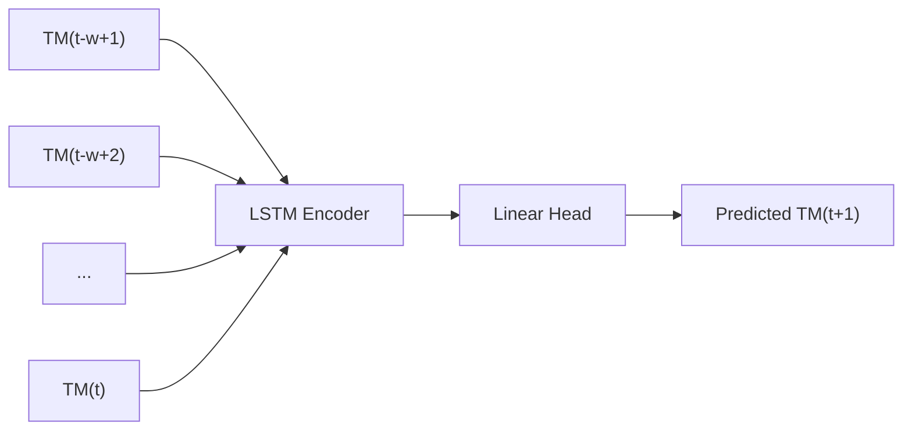
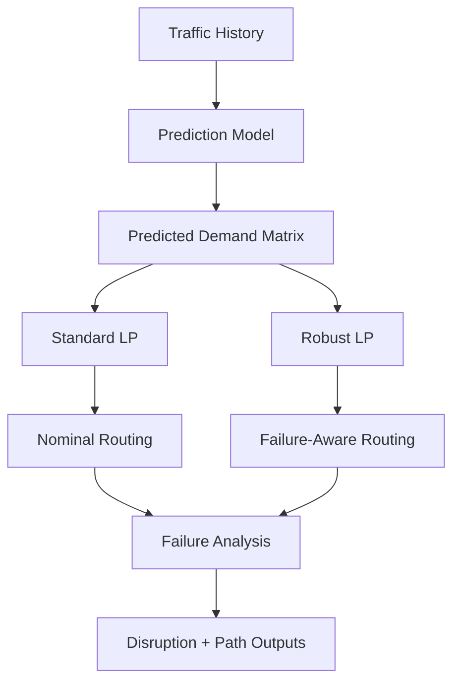

# Algorithms and Formulations

## 1. Traffic Prediction Models

### Moving Average

The moving average predictor estimates the next traffic matrix as the average
of the recent history window.

Use:

- simple baseline
- low variance
- no training required

### Linear Autoregressive Predictor

The linear autoregressive predictor fits a least-squares model:

```text
x_hat(t+1) = b + A * x(t)
```

where:

- `x(t)` is the flattened current traffic matrix
- `A` is the learned linear transformation
- `b` is the intercept

Use:

- stronger classical baseline
- interpretable linear forecast

### LSTM Predictor

The LSTM predictor uses a sequence of recent traffic matrices as input and
predicts the next traffic matrix.

Input:

- batch size
- history window
- flattened traffic matrix dimension

Output:

- flattened predicted next traffic matrix

Use:

- model temporal dependence
- capture bursty or delayed demand effects



## 2. Standard Routing Optimization

### Design formulation

The network is modeled as a directed graph:

```text
G = (V, E)
```

Each source-destination pair defines a commodity `k`, and each link `(i, j)`
has capacity `c(i,j)`.

Decision variable:

```text
f_k(i,j)
```

which represents the amount of commodity `k` routed on link `(i, j)`.

### Constraints

#### Flow conservation

For each commodity `k` and node `v`:

- if `v` is the source: outgoing - incoming = demand
- if `v` is the destination: outgoing - incoming = -demand
- otherwise: outgoing - incoming = 0

#### Capacity constraints

```text
sum over k of f_k(i,j) <= U * c(i,j)
```

where `U` is the maximum link utilization.

#### Nonnegativity

```text
f_k(i,j) >= 0
```

### Objective

```text
minimize U
```

This is the classic min-max-utilization traffic engineering objective.

## 3. Robust Routing Optimization

The robust LP extends the nominal formulation by solving simultaneously across:

- the nominal network
- selected failure scenarios

It introduces:

- nominal utilization variable
- worst-case utilization variable

and optimizes a weighted combination:

```text
minimize alpha * U_nominal + (1 - alpha) * U_worst
```

In the current code:

- `alpha = 0.35` on the nominal term
- `0.65` is placed on the worst-case term

In the current implementation:

- nominal case is included
- a small number of physical-link failure scenarios are included
- each scenario removes the selected link bundle from the graph

## 4. Failure Evaluation Modes

### Re-optimization after failure

The failed link bundle is removed and the LP is solved again.

This answers:

- how well could the controller recover if it reroutes after the failure?

### Fixed-routing stress evaluation

The original routing plan is kept fixed and any routed flow that used the
failed bundle is counted as disrupted.

This answers:

- how fragile was the pre-failure routing plan?

## 5. Commodity Disruption Analysis

For each failure scenario, the code identifies:

- top disrupted commodities
- disrupted flow amount
- disrupted fraction of the commodity demand

This makes the results interpretable beyond network-wide averages.

## 6. Path Decomposition

For each disrupted commodity, the routed flow is decomposed into a small set of
paths by repeatedly extracting a path from the routed subgraph and removing the
bottleneck flow.

This allows us to show:

- exact vulnerable route sequences
- whether the failed link bundle belonged to those paths

## 7. Algorithm Relationships



## 8. Why These Algorithms Fit the Project

These methods line up well with the project goals:

- prediction models support learning-augmented control
- LP routing gives a mathematically grounded design formulation
- robust LP introduces a true failure-aware optimization baseline
- disruption and path analysis make the resilience results explainable
