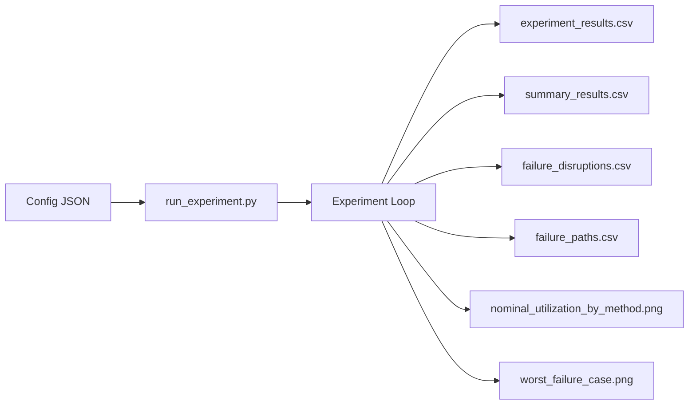

# Experiment Guide

## Environment

Activate the project-local environment:

```powershell
.\.venv\Scripts\Activate.ps1
```

Or run commands directly:

```powershell
.\.venv\Scripts\python.exe .\run_experiment.py --config .\configs\abilene.json
```

## Available Configurations

- `configs/sample.json`
- `configs/abilene.json`
- `configs/nsfnet.json`

## Example Commands

### Synthetic sample network

```powershell
.\.venv\Scripts\python.exe .\run_experiment.py --config .\configs\sample.json
```

### Abilene benchmark

```powershell
.\.venv\Scripts\python.exe .\run_experiment.py --config .\configs\abilene.json
```

### NSFNET benchmark

```powershell
.\.venv\Scripts\python.exe .\run_experiment.py --config .\configs\nsfnet.json
```

### Multi-run sweep

```powershell
.\.venv\Scripts\python.exe .\run_sweep.py --topologies abilene nsfnet --load-scales 0.8 1.0 1.2 --seeds 7 11
```

## What Each Run Produces



### `experiment_results.csv`

Per-time-step metrics for each method, including:

- prediction error
- nominal utilization
- re-optimization after failure
- fixed-routing disruption fractions
- robust LP metadata columns

### `summary_results.csv`

Method-level averages across all evaluation time steps.

Use this file for:

- comparison tables in the report
- quick ranking of methods

### Sweep aggregate outputs

The sweep runner creates:

- `all_run_summaries.csv`
  one summary row per method per run
- `aggregated_summary.csv`
  averages grouped by topology, load scale, and method
- `run_index.csv`
  mapping from each sweep run to its output subfolder

### Aggregated plot outputs

Generate clean summary figures from a completed sweep with:

```powershell
.\.venv\Scripts\python.exe .\run_plot_summary.py --input .\outputs\sweeps_full\aggregated_summary.csv --output-dir .\outputs\sweeps_full\plots
```

This produces:

- `summary_nominal_utilization.png`
- `summary_critical_fixed_disruption.png`
- `summary_critical_fixed_fairness.png`
- `abilene_robust_vs_standard_lp.png`
- `nsfnet_robust_vs_standard_lp.png`
- `robust_lp_comparison.csv`

## Preparing Report Assets

After the final sweep is complete, prepare a clean set of tables and
presentation figures with:

```powershell
.\.venv\Scripts\python.exe .\run_prepare_report_assets.py --sweep-dir .\outputs\sweeps_report
```

This writes:

- `report_assets/figures/`
- `report_assets/tables/`
- `report_assets/PRESENTATION_FIGURES.md`

### `failure_disruptions.csv`

Lists the most disrupted commodities in fixed-failure scenarios.

Use this file for:

- identifying vulnerable traffic demands
- interpreting which flows are fragile

### `failure_paths.csv`

Contains path-level decomposition for disrupted commodities.

Use this file for:

- showing which routes traversed a failed link
- extracting example paths for the report or presentation

### `nominal_utilization_by_method.png`

Bar chart of average nominal utilization across methods.

### `worst_failure_case.png`

Network visualization of the most severe disrupted commodity case.

## How To Read the Main Metrics

### Prediction metrics

- lower `prediction_mae` is better
- lower `prediction_rmse` is better

### Routing metrics

- lower `nominal_max_utilization` is better
- lower `critical_failure_reopt_max_utilization` is better
- lower `random_failure_reopt_max_utilization` is better

### Fixed-routing disruption metrics

- higher `*_fixed_served_fraction` is better
- lower `*_fixed_disrupted_fraction` is better

### Fairness metrics

- higher `critical_failure_fixed_fairness` is better
- higher `random_failure_fixed_fairness` is better

These use Jain's fairness index over commodity served ratios after a fixed
failure event.

### Robust LP metadata

- `robust_nominal_utilization` = nominal scenario objective value for the robust LP
- `robust_worst_case_utilization` = optimized worst-case value across selected robust scenarios
- `robust_failure_scenarios` = scenario set used for that robust optimization run

## Suggested Analysis Flow

1. Compare nominal utilization across methods.
2. Compare re-optimization behavior after failures.
3. Compare fixed-routing disruption fractions.
4. Compare fixed-failure fairness values.
5. Open `failure_disruptions.csv` to find the most fragile commodities.
6. Open `failure_paths.csv` to inspect the actual vulnerable routes.
7. Use `worst_failure_case.png` as a presentation figure.

## Notes for the Final Report

The best story is not only "which method has the lowest average congestion."
It is also:

- which method is most resilient after failures
- which commodities are vulnerable
- why the vulnerable routes failed
- whether the robust LP changes that behavior

## GitHub Rendering Note

The equations in this repo are written in plain-text code blocks rather than
LaTeX-heavy Markdown so they remain readable in GitHub without relying on math
rendering support.
