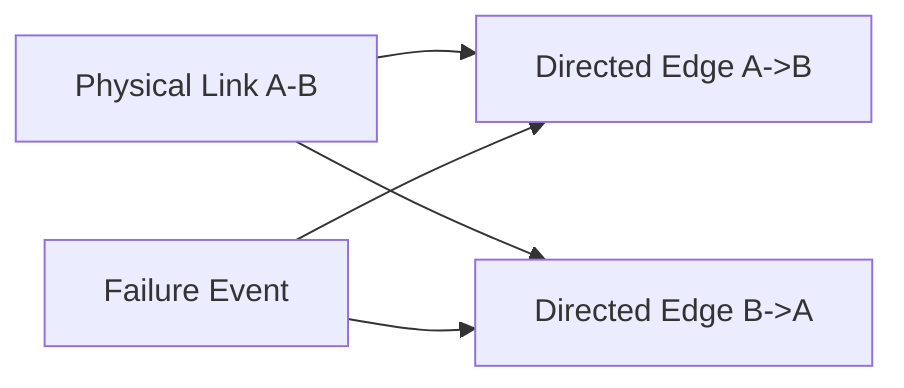
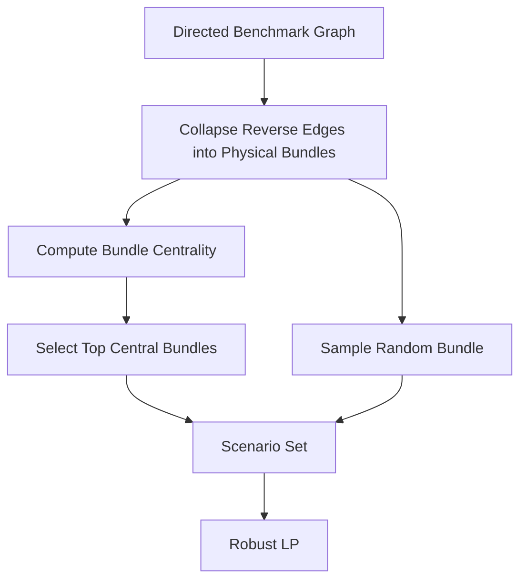

# Robust Failure Model

## Motivation

A single directed-edge failure is often not the right abstraction for backbone
networks. In practice, a physical link between two sites often affects both
directions when it fails.

For that reason, the project uses a physical-link bundle model where:

- if edge `u -> v` fails
- and edge `v -> u` exists
- both directed edges are removed together as one failure event



## Failure Bundles

The code constructs a bundle from a chosen edge:

- chosen edge
- reverse edge if present

Examples:

- `Houston -> Atlanta & Atlanta -> Houston`
- `Denver -> Kansas City & Kansas City -> Denver`

This bundle is used consistently in:

- failure evaluation
- fixed-routing disruption analysis
- robust scenario selection
- visualization

## Critical Failure Selection

Critical physical links are chosen by aggregating routing load across the two
directions of the same physical connection. The most heavily used bundle is
selected as the critical failure scenario for stress analysis.

This is better than selecting only one directed edge because it matches the
physical-link interpretation.

## Random Failure Selection

Random failure scenarios are sampled from the set of unique bundles, rather
than from individual directed edges.

## Robust Scenario Construction

The current robust scenario selector builds a small scenario set by choosing:

- up to two topologically central physical links, based on edge betweenness
- one random physical link bundle



This is a practical approximation that keeps the robust LP tractable while
still exposing it to plausible disruptions.

## Robust LP Interpretation

The robust LP solves the routing problem across:

- nominal network
- selected failure bundles

Plain-text objective:

```text
minimize 0.35 * U_nominal + 0.65 * U_worst
```

Interpretation:

- `U_nominal` controls normal operating congestion
- `U_worst` controls the worst congestion over the selected failure bundles

The nominal routing stored in the output corresponds to the nominal scenario,
but the optimization is influenced by the additional failure scenarios through
the worst-case utilization term.

## Current Limitations

- scenario selection is still small and heuristic
- the robust objective is weighted manually rather than tuned systematically
- the robust LP currently optimizes feasibility/congestion under bundled
  failures, but it does not yet enforce explicit backup-path disjointness

## Recommended Future Extensions

- larger scenario libraries with sampling
- demand-scaled stress scenarios
- link-disjoint backup design
- risk-aware weighting of failure scenarios
- scenario probabilities or chance constraints
