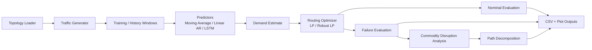
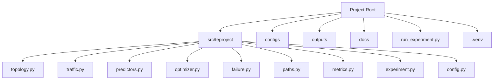
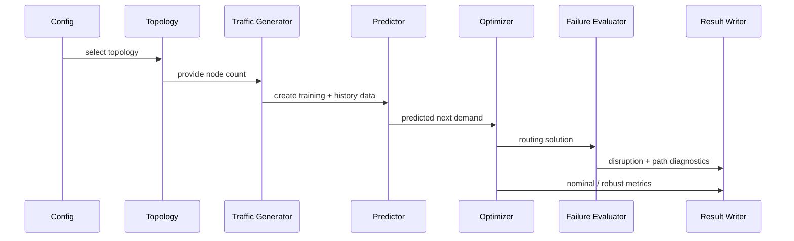

# System Architecture

## End-to-End Pipeline

The project follows this pipeline:

1. Load a topology.
2. Generate a sequence of traffic matrices.
3. Train traffic predictors on the training prefix.
4. For each evaluation time step:
   - gather recent traffic history
   - predict the next traffic matrix
   - solve the routing problem
   - evaluate nominal routing quality
   - evaluate performance under failure scenarios
   - record disruption and path-level details
5. Aggregate results into CSV summaries and plots.

## Directory Structure

- `src/teproject/`
  - all implementation modules
- `configs/`
  - experiment configuration files
- `outputs/`
  - experiment result folders
- `docs/`
  - implementation documentation only
- `.venv/`
  - dedicated project environment

## Repository Layout Diagram

## Module Responsibilities

### `config.py`

Defines the experiment configuration model and loads JSON config files.

Main responsibilities:

- topology selection
- number of time steps
- train/test split parameters
- output subfolder selection
- feature toggles such as LSTM enablement

### `topology.py`

Handles network construction and topology loading.

Responsibilities:

- build the synthetic backbone
- load benchmark graphs from TopoHub
- convert benchmark graphs into directed TE graphs
- assign heuristic capacities and weights

### `traffic.py`

Generates synthetic dynamic traffic matrices.

Responsibilities:

- create base demand
- impose periodic and slow cyclic patterns
- add noise
- inject hotspot events

### `predictors.py`

Contains all demand prediction models.

Responsibilities:

- moving average baseline
- linear autoregressive baseline
- LSTM model definition
- LSTM training and one-step prediction

### `optimizer.py`

Contains optimization-based routing solvers.

Responsibilities:

- standard min-max-utilization LP
- scenario-based robust LP
- extraction of routing flows and edge loads

### `failure.py`

Contains failure-scenario logic.

Responsibilities:

- identify critical physical link bundles
- sample random physical link bundles
- select robust optimization scenarios
- evaluate routing after failures
- evaluate fixed-routing disruption after failures

### `paths.py`

Performs path decomposition of routed commodity flow.

Responsibilities:

- isolate routed subgraph for one commodity
- decompose flow into a small number of paths
- report whether disrupted commodities traversed the failed link

### `metrics.py`

Defines quality metrics.

Responsibilities:

- prediction MAE and RMSE
- nominal and average link utilization

### `experiment.py`

Coordinates the full experiment loop.

Responsibilities:

- run all predictors and LP methods
- add the robust routing baseline
- generate disruption and path tables
- generate summary charts

## Control Flow by Evaluation Step

## Data Flow

### Inputs

- topology choice from `configs/*.json`
- synthetic traffic generation settings

### Intermediate state

- training traffic matrices
- predicted demand matrices
- routing outputs
- failure evaluations

### Outputs

- method-level metrics
- disruption-level metrics
- path-level diagnostics
- visualization artifacts

## Why This Architecture Is Useful

This architecture separates the project into clear layers:

- data generation
- prediction
- optimization
- resilience evaluation
- reporting

That makes the code easier to explain, test, and extend for the final report.
